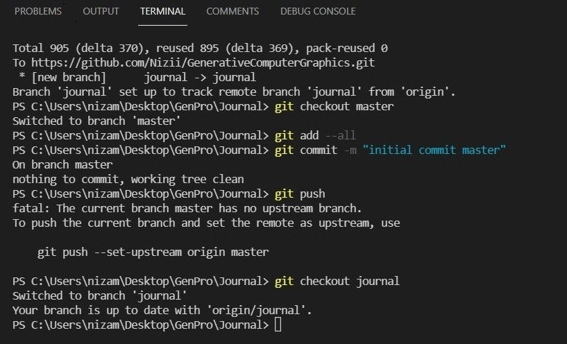

# Day 01

## The Game Sprouts
### Rules (copyed)
The game starts by drawing any number of spots. For example 3 spots. The first player has a turn by joining two of the spots and marking a new spot in the middle of the line. Or the line may start and end on the same spot.

You are not allowed to draw a line which crosses another line. A spot cannot have more than three lines leading to or from it. The idea is to make it impossible for the other player to draw a line. So the last person to draw a line is the winner.

### Our thoughts
We started with three points and then increased to five points at the beginning.
In the last step we tried to draw straight lines only (picture bottom right).

## Rest of the day
After the input, i learned how to configure my git from the console.
