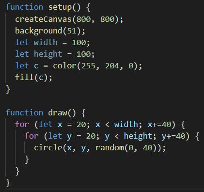

# Day 02
## End Result
//IFrame einsetzen

## My Dev. Process
My first sketches, i chose circles. I wanted to keep it simple as possible.

The main element in my 2D grid is now a simple circle.

I randomized the diameter of each circle for each frame.

Here you see the result of it.

Colored the circels yellow.

Trys.

More trys...

...and one More.

My full code.

