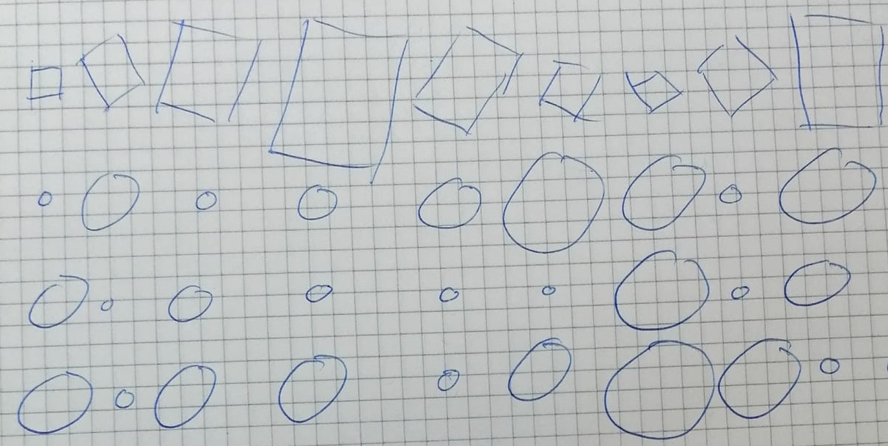
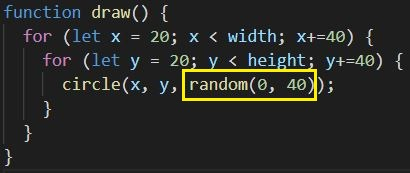
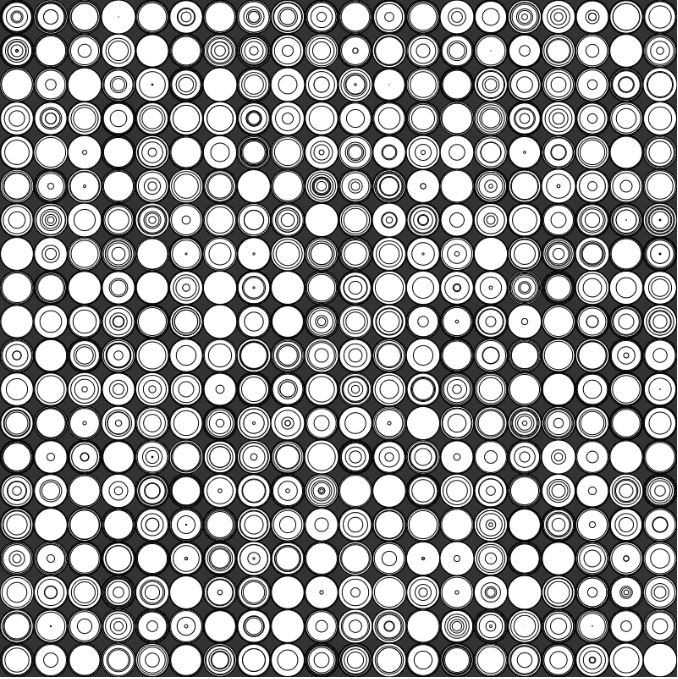
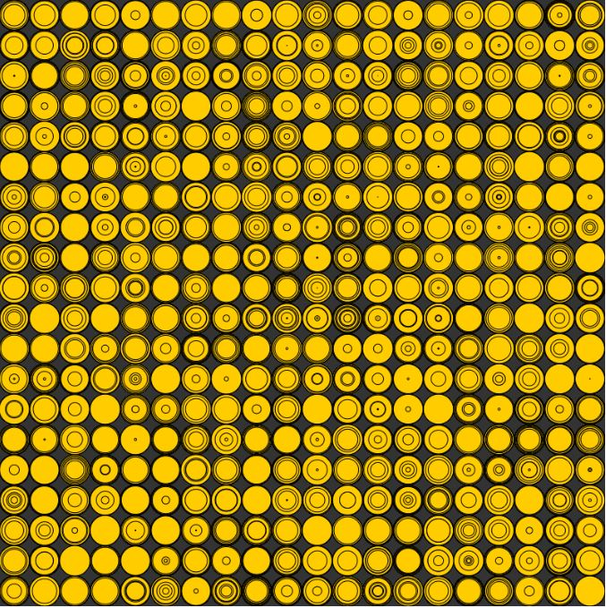
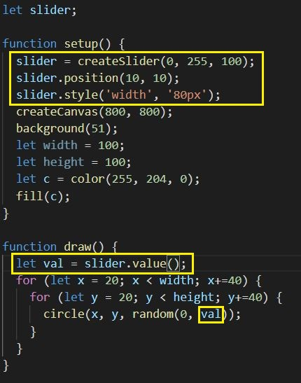
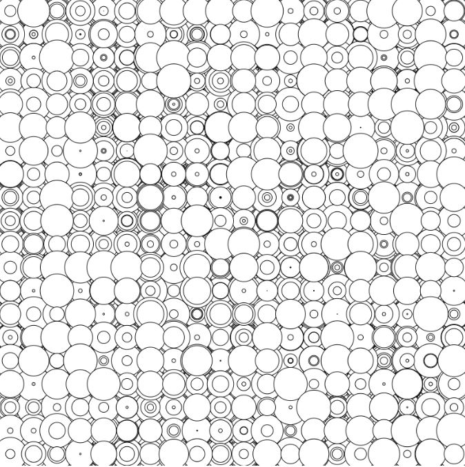
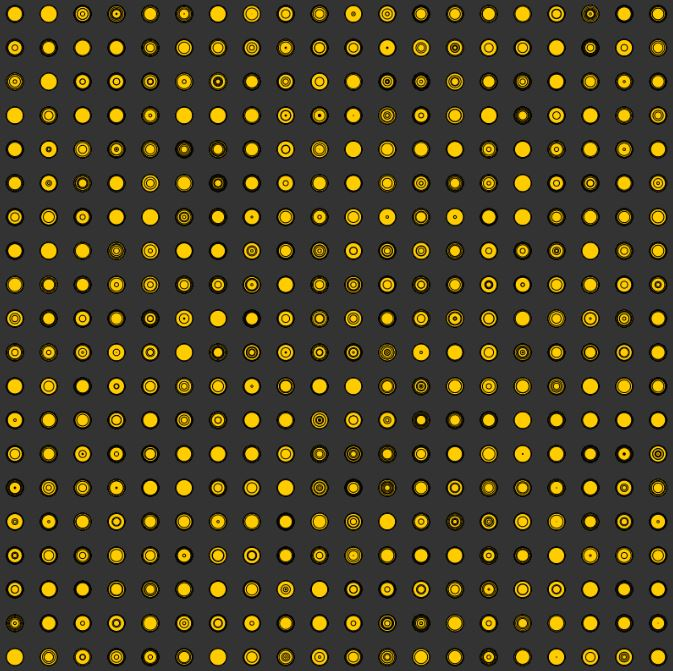
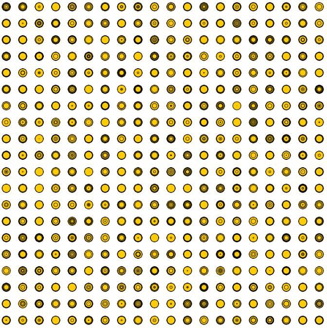

# Day 02

## My Dev. Process
My first sketches, i chose circles. I wanted to keep it simple as possible.
I have tryed it with different shapes, but I liked it most with circles.

The main element in my 2D grid is now a simple circle.

I randomized the diameter of each circle for each frame.

Here you see the result of it.

Colored the circels yellow.

Added a slider to scale the diameter live and tryed a few times...

More trys...

More trys...

...and one More.

To expand the work, I could imagine working with 3d objects. 

## Live example
<iframe src="../../p5js/Day2 Grids & Iterative Patterns/index.html" width="600" height="600" frameborder="0" allow="autoplay; fullscreen; picture-in-picture" allowfullscreen></iframe>

Code-> <https://github.com/Nizii/GenerativeComputerGraphics/tree/journal/p5js/Day2%20Grids%20%26%20Iterative%20Patterns>

