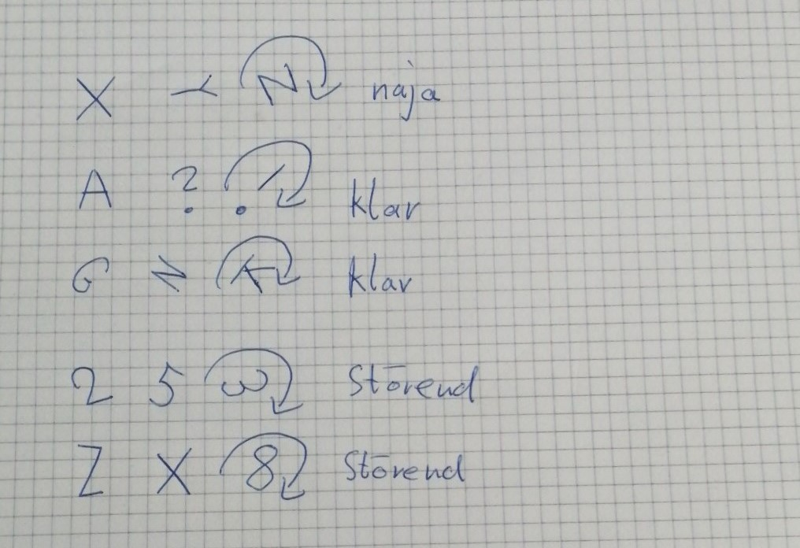
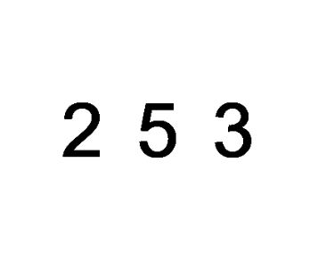
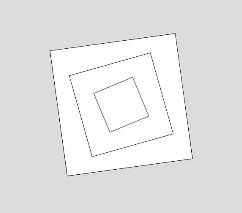
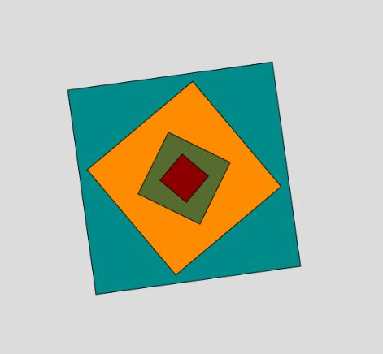
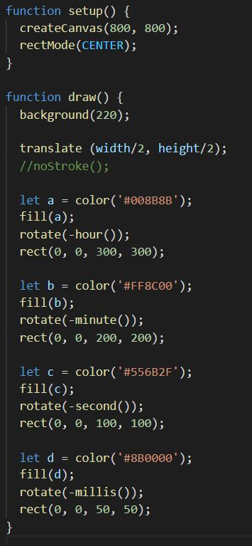

# Day 03

## Clock
### My thoughts

### My sketch
I wanted to make a clock with three symbols that rotate around their own axis. 
My thought was, if I use static numbers as rotating symbols, then this could trigger the viewer.
Because you normally assume that the number has to change.

But i had some problem with the rotation of the text symbols. 
After a few unsuccessful attempts, I had to reorient myself. Because i lost to much time.

...so i changed my concept... 

...and here is the result.

As i said, after that i didn't have that much time that day, I made a simple watch that still meets the topic from my point of view.
every square has its own time unit. The small rectangel in the middle rotate every milli second. The second smallest just every second and so it goes with minutes and the biggest rectangel rotates every hour. The clock has no clock digits.

Live example
<iframe src="../../p5js/Day3 Clock/index.html" width="600" height="600" frameborder="0" allow="autoplay; fullscreen; picture-in-picture" allowfullscreen></iframe>

My Code

Code-> <https://github.com/Nizii/GenerativeComputerGraphics/tree/journal/p5js/Day3%20Clock>