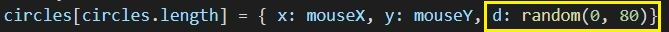
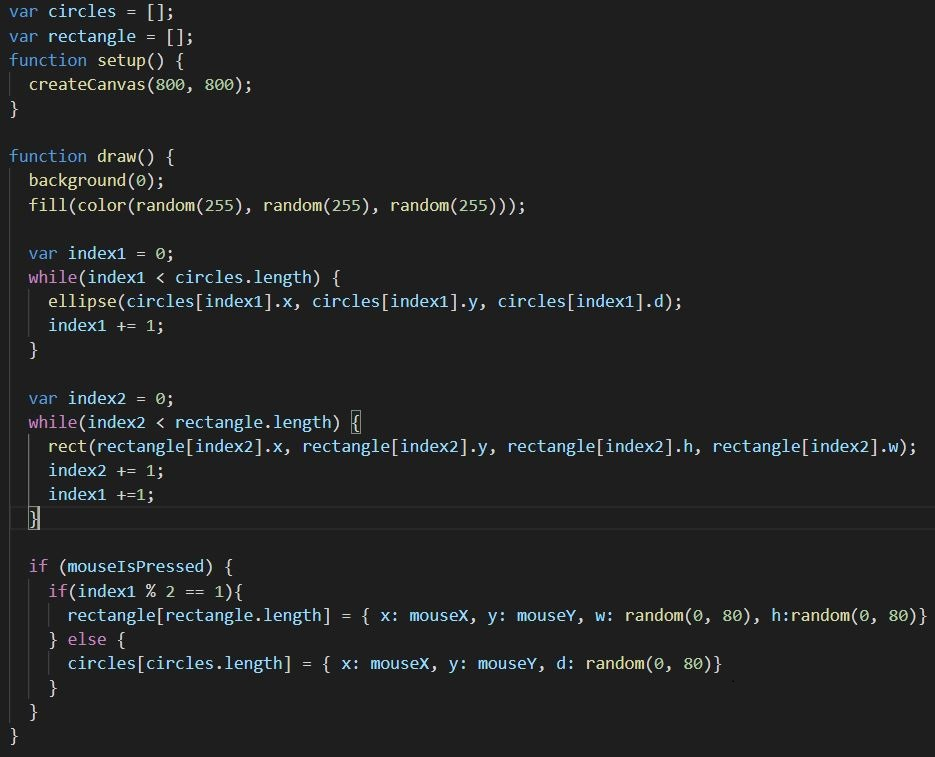

# Day 04

## Drawing machine
My first goal was to program a drawing machine where I can draw something directly into a frame with the mouse. 
I started drawing with circles. 

I've made a few tries with different colors.

Then i started playing with changing diamteters of the circles.

Here are some results.

i drew with different shapes.

I've made a couple of combinations too.

### Live example rectangles

Click with the mouse on the black field below and keep it pressed to draw a picture.
<iframe src="../../p5js/Day4/index.html" width="800" height="800" frameborder="0" allow="autoplay; fullscreen; picture-in-picture" allowfullscreen></iframe>

### Live example circles
Click with the mouse on the black field below and keep it pressed to draw a picture.
<iframe src="../../p5js/Day4/indexc.html" width="800" height="800" frameborder="0" allow="autoplay; fullscreen; picture-in-picture" allowfullscreen></iframe>

### Code snip

### Code
<https://github.com/Nizii/GenerativeComputerGraphics/tree/journal/p5js/Day4>
