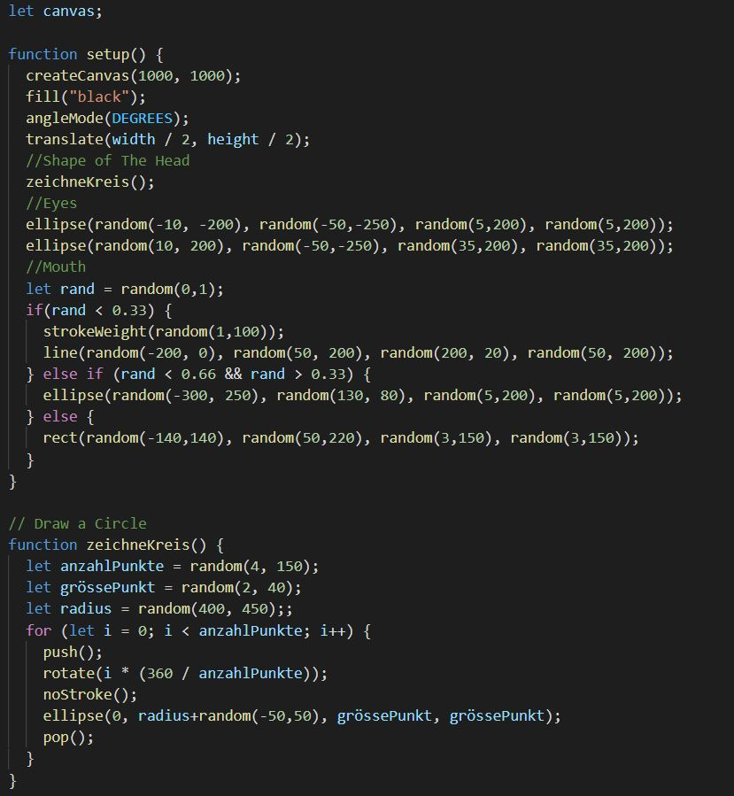

# Day 05

## Faces

###


<iframe src="https://github.com/digitalideation/gencg_h2101/tree/master/notes/day05#books-resources" width="640" height="360" frameborder="0" allow="autoplay; fullscreen; picture-in-picture" allowfullscreen></iframe>



###

###

###

###

###

###

### My Code
