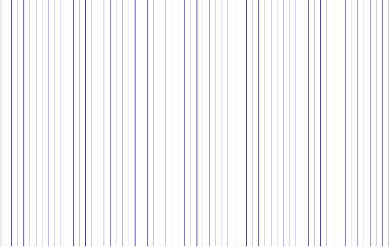
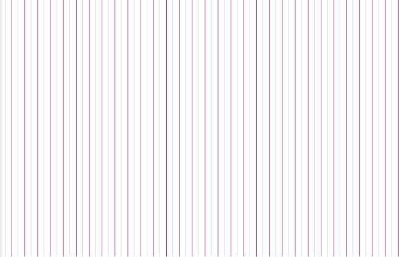
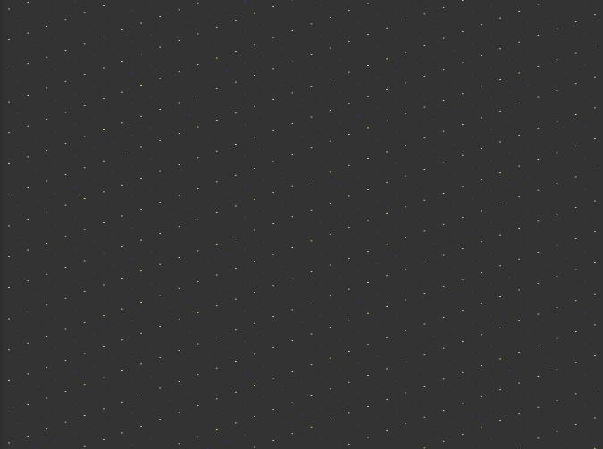
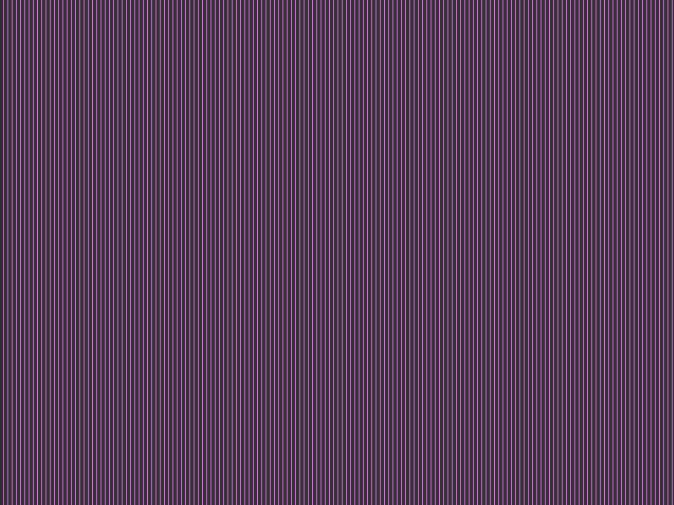
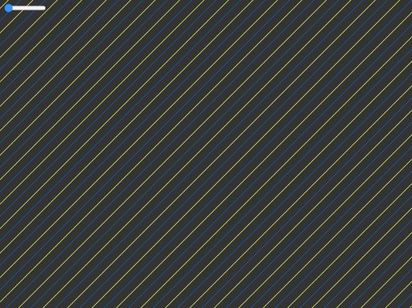
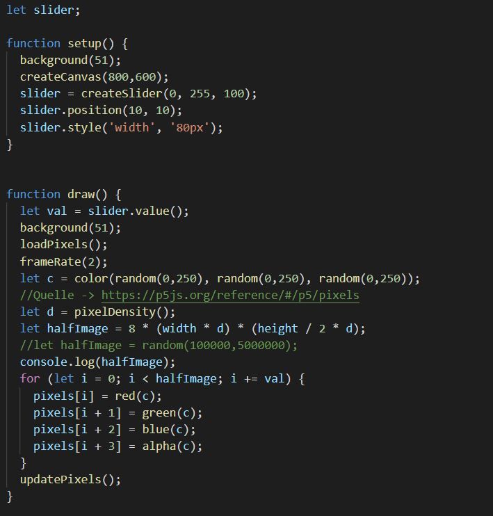

# Day 06

## Pixels

### Live example

<iframe width="800" height="500" src="../../p5js/Day6%20Pixels/index.html" title="YouTube video player" frameborder="0" allow="accelerometer; autoplay; clipboard-write; encrypted-media; gyroscope; picture-in-picture" allowfullscreen></iframe>

### further examples

### further examples

### further examples

### further examples

### further examples

### further examples

### My code
