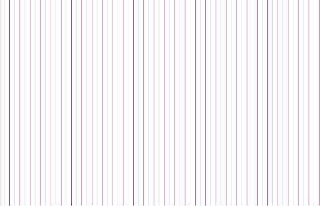

# Day 06

## Pixels
At the beginning i didn't know how to start my work. So i went to the p5js website.
I played around with the code with different parameters and tried a few things.

Sources: https://p5js.org/reference/#/p5/pixels

### Live example
<iframe width="800" height="500" src="../../p5js/day06%20Pixels/index.html" title="YouTube video player" frameborder="0" allow="accelerometer; autoplay; clipboard-write; encrypted-media; gyroscope; picture-in-picture" allowfullscreen></iframe>

### My code

Code-> <https://github.com/Nizii/GenerativeComputerGraphics/tree/journal/p5js/Day6%20Pixels>
