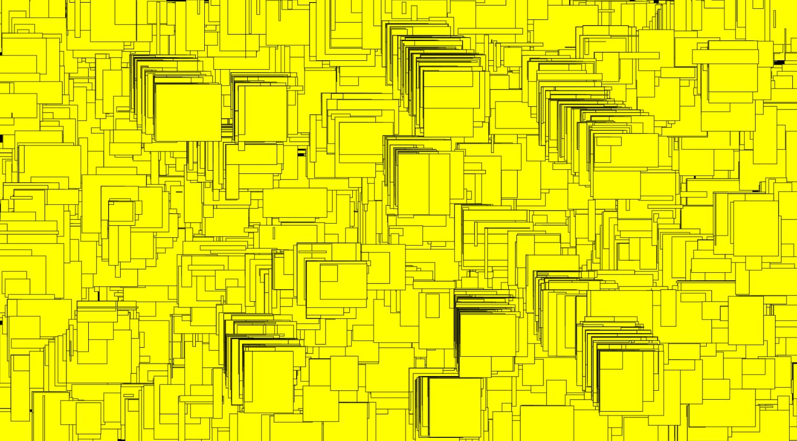
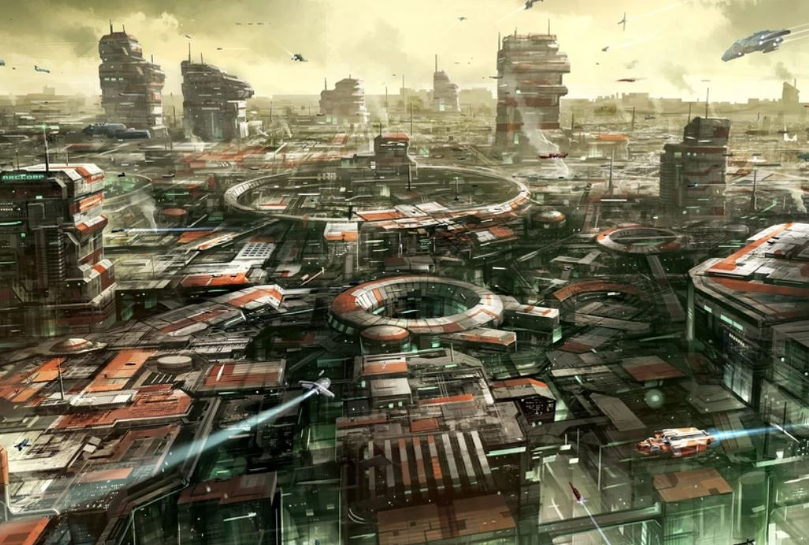

# Day 07+08

# Documentation
I thought about creating the documentation with Notion. But then I decided on markdown because I wanted to learn something new. In addition to markdown, I learned how to use github correctly in this course. I really appreciate the knowledge gained on this course. In addition to the programming techniques that I have acquired.

# My extendet work

For my extended work i chose the topic from day four the drawing machine.

I got my inspiration from the game starcitisen from the planet ArcCorp. I wanted to generate an automatically, randomly generated, futuristic city surface. At the beginning the background is created. After 1000 loops, the machine randomly creates houses of three different sizes. The view of the picture is from above and it takes about 40 seconds until the picture is completely drawn.
In order to expand the work, I thought that I could increase the intensity of the rectangles at a certain point in the basic image in order to create a little irregularity on the surface. 
Another idea would be to work with 3d objects.

<iframe width="900" height="900" src="../../p5js/My extended work/index.html" title="YouTube video player" frameborder="0" allow="accelerometer; autoplay; clipboard-write; encrypted-media; gyroscope; picture-in-picture" allowfullscreen></iframe>

### Code 
<https://github.com/Nizii/GenerativeComputerGraphics/tree/journal/p5js/My%20extended%20work>

