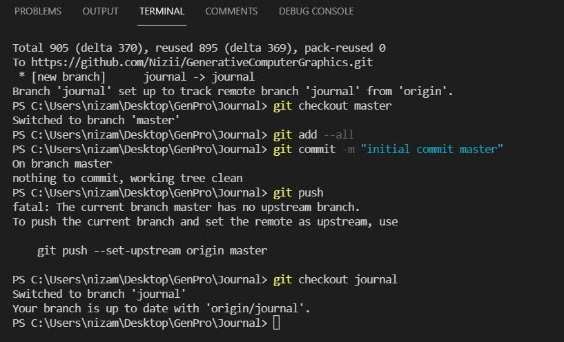
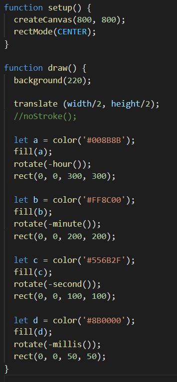
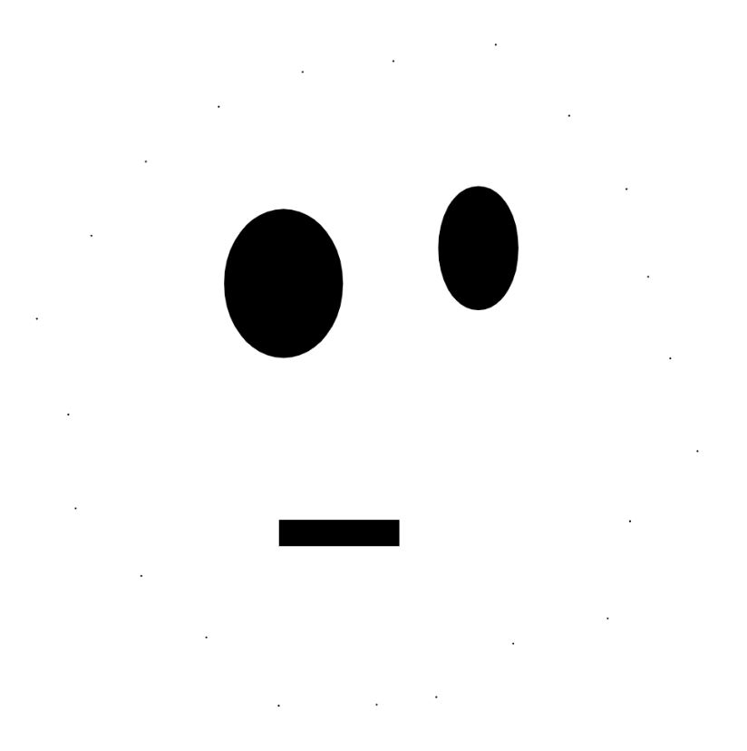
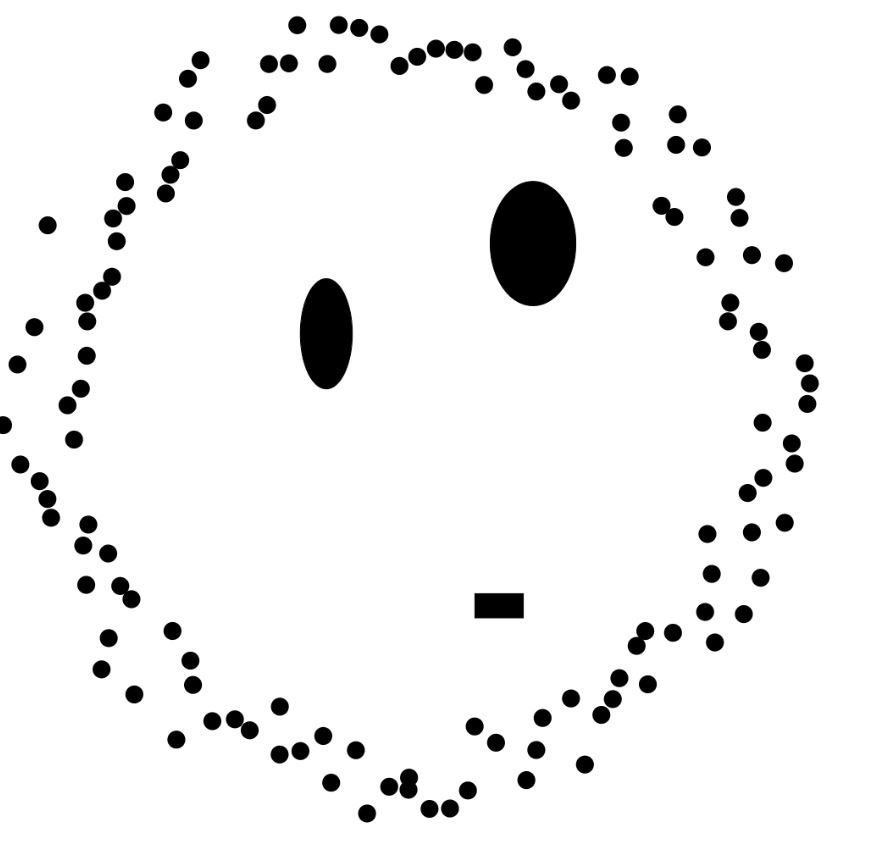
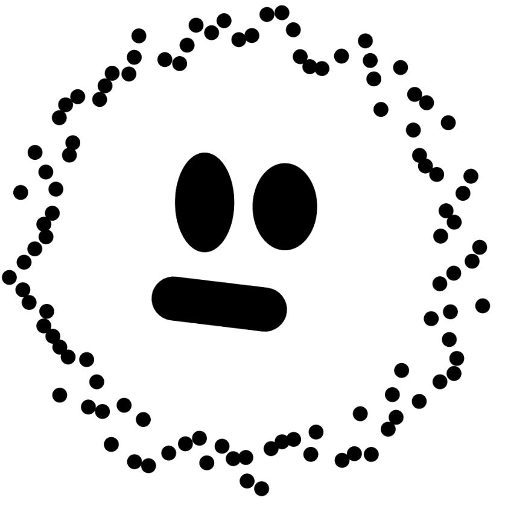
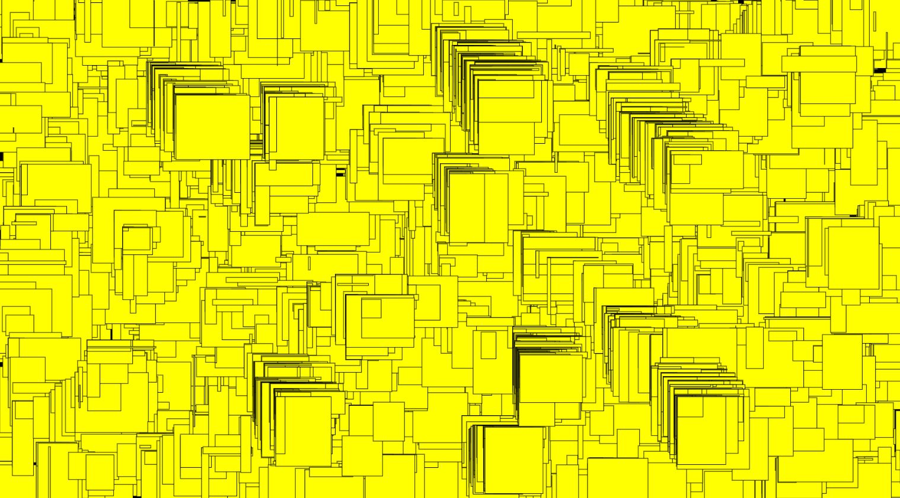

# Day 01

## The Game Sprouts
### Rules (copyed)
The game starts by drawing any number of spots. For example 3 spots. The first player has a turn by joining two of the spots and marking a new spot in the middle of the line. Or the line may start and end on the same spot.

You are not allowed to draw a line which crosses another line. A spot cannot have more than three lines leading to or from it. The idea is to make it impossible for the other player to draw a line. So the last person to draw a line is the winner.

### Our thoughts
We started with three points and then increased to five points at the beginning.
In the last step we tried to draw straight lines only (picture bottom right).

## Rest of the day
After the input, i learned how to configure my git from the visual code console.

# Day 02
## Grids

## My Dev. Process
My first sketches, i chose circles. I wanted to keep it simple as possible.

The main element in my 2D grid is now a simple circle.

I randomized the diameter of each circle for each frame.

Here you see the result of it.

Colored the circels yellow.

Added a slider to scale the diameter live and tryed a few times...

More trys...

More trys...

...and one More.

## Live example
<iframe src="../../p5js/Day2 Grids & Iterative Patterns/index.html" width="600" height="600" frameborder="0" allow="autoplay; fullscreen; picture-in-picture" allowfullscreen></iframe>

# Day 03
## Clock
### My thoughts

### My sketch

### I had some problem with the rotation of the text symbols...

### ...so i changed my concept... 

### ...and here is the result
The small rectangel in the middle rotate every milli second. The second smallest just every second and so it goes with minutes and the biggest rectangel rotates every hour. The clock has no clock digits.

### Live example
<iframe src="../../p5js/Day3 Clock/index.html" width="600" height="600" frameborder="0" allow="autoplay; fullscreen; picture-in-picture" allowfullscreen></iframe>

### My Code

# Day 04
## Drawing machine

### examples

### examples

### Live example rectangles
<iframe src="../../p5js/Day4/index.html" width="800" height="800" frameborder="0" allow="autoplay; fullscreen; picture-in-picture" allowfullscreen></iframe>

### Live example circles
<iframe src="../../p5js/Day4/indexc.html" width="800" height="800" frameborder="0" allow="autoplay; fullscreen; picture-in-picture" allowfullscreen></iframe>

### My Code

# Day 05
## Faces
My program draws different smilies. 
The smilies are generated randomly and have different facial expressions.

### Live example
<iframe src="../../p5js/Day5/index.html" width="800" height="800" frameborder="0" allow="autoplay; fullscreen; picture-in-picture" allowfullscreen></iframe>

### My Code

# Day 06

## Pixels
At the beginning i didn't know how to start my work. So i went to the p5js website.
I played around with the code with different parameters and tried a few things.

Sources: https://p5js.org/reference/#/p5/pixels

### Live example
<iframe width="800" height="500" src="../..//p5js/Day6%20Pixels/index.html" title="YouTube video player" frameborder="0" allow="accelerometer; autoplay; clipboard-write; encrypted-media; gyroscope; picture-in-picture" allowfullscreen></iframe>

### My code

# My extendet work

For my extended work i chose the topic from day four the drawing machine.

I got my inspiration from the game starcitisen. I wanted to generate an automatically, randomly generated, futuristic city surface.

At the beginning the background is created. After 1000 loops, the machine randomly creates houses.
<iframe width="900" height="900" src="http://127.0.0.1:5500/p5js/ext/index.html" title="YouTube video player" frameborder="0" allow="accelerometer; autoplay; clipboard-write; encrypted-media; gyroscope; picture-in-picture" allowfullscreen></iframe>
